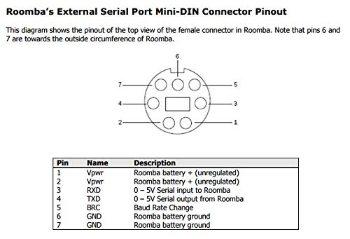

# ROMBA-dashbord-RC

A mobile-first dashboard for controlling a Roomba 886 over a REST API (targeting an ESP32 SCI bridge).

## Core features
- Real-time commands: `Clean`, `Spot`, `Safe`, `Stop`.
- Live sensor polling from `/api/sensors` (roughly every 3 seconds from the UI side).
- Battery status display (mV + estimated percentage), charging state, current, and button bitmap.
- Full dynamic rendering of all keys returned by `/api/sensors`.
- Responsive UI and keyboard navigation support.

## Expected REST API from ESP32
- `GET /api/status`
- `GET /api/sensors`
- `POST /api/clean`
- `POST /api/spot`
- `POST /api/safe`
- `POST /api/stop`

## Example `/api/sensors` JSON
```json
{
  "battery_mV": 15600,
  "charging_state": 2,
  "current_mA": -320,
  "buttons": 0,
  "bump_left": false,
  "bump_right": false,
  "wheel_drop_left": false,
  "wheel_drop_right": false
}
```

## Quick start for Roomba 886 (2 minutes)
1. Find the ESP32 IP on your Wi-Fi network (for example: `192.168.1.50`).
2. Open the dashboard.
3. In **API Connection Setup**, enter: `http://<ESP32-IP>`.
4. Click **Save Address**, then **Test Connection**.
5. If the top status shows **Connected to Roomba**, you are good to go.

## Local Python hosting
1. From the project folder, start a local web server with `python3 -m http.server 8000`.
2. Open the dashboard at `http://localhost:8000`.
3. In **API Connection Setup**, enter the ESP32 address for your Roomba 886 setup (`http://192.168.1.50` pattern) and click **Save Address**.
4. The address is persisted in `localStorage`, so you do not need to re-enter it every time.
5. Optional: open directly with a URL parameter:
   - `http://localhost:8000/?apiBase=http://192.168.1.50`
   - Alias `?api=...` is also supported.
6. If you open the dashboard from another device on your LAN, replace `localhost` with your computer's local IP address.

## Roomba 886 Mini-DIN pinout



- Pin 1: `Vpwr` - Roomba battery positive (unregulated)
- Pin 2: `Vpwr` - Roomba battery positive (unregulated)
- Pin 3: `RXD` - 0-5V serial input to Roomba
- Pin 4: `TXD` - 0-5V serial output from Roomba
- Pin 5: `BRC` - Baud rate change
- Pin 6: `GND` - Roomba battery ground
- Pin 7: `GND` - Roomba battery ground

## ESP32 + Roomba 886 setup notes
1. Open `esp32/roomba_dashboard_api.ino` and set `WIFI_SSID` and `WIFI_PASS`.
2. Verify UART wiring between ESP32 and Roomba (`RX=GPIO16`, `TX=GPIO17`, per code).
3. Upload the sketch using Arduino IDE or PlatformIO.
4. Open Serial Monitor at `115200` baud and verify network connection + printed IP.
5. In the dashboard, save API base in `http://<ip>` format and click **Test Connection**.
6. If `/api/sensors` returns `sensor_read_failed`, check:
   - TX/RX wiring,
   - shared GND,
   - Roomba in START/SAFE mode.
7. Recommended: begin with `esp32/roomba_basic_start.ino` to validate baseline command response before enabling full API mode.
